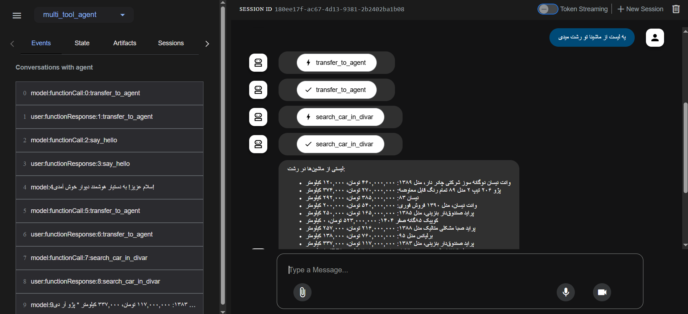

# Multi-Tool Agent for Divar

This project is a Python-based AI agent system designed to interact with Divar.ir, a popular Iranian online marketplace. The system uses Google's ADK (Agent Development Kit) to create specialized agents for various tasks, such as searching for cars, real estate, and retrieving post details.

## Features

- **Greeting Agent**: Provides friendly Persian greetings.
- **Farewell Agent**: Handles polite Persian goodbyes.
- **Car Search Agent**: Searches for car listings in a specified city.
- **Real Estate Agent**: Searches for real estate listings in a specified city.
- **Post Details Agent**: Retrieves detailed information about specific Divar posts using their post ID.

## Installation

1. Clone the repository:

   ```bash
   git clone <repository-url>
   cd multi_tool_agent
   ```

2. Install dependencies:

   ```bash
   pip install -r requirements.txt
   ```

3. Set up environment variables:
   - Create a `.env` file in the root directory.
   - Add the following keys:
     ```properties
     GOOGLE_GENAI_USE_VERTEXAI=FALSE
     GOOGLE_API_KEY=<Your Google API Key>
     DIVAR_API_KEY=<Your Divar API Key>
     ```

## Running the Project

To run the project, you can use the ADK CLI. Ensure that the ADK CLI is installed and properly configured on your system.

### Start the Web Interface

Run the following command to start the web interface:

```powershell
adk web
```

This will launch a local web server where you can interact with the agents. Make sure your environment variables are correctly set before running this command.


